# Up Dog Studios
Up Dog Studios is a yoga studio based in Brighton, England, and run by a passionate team who's goal is to make yoga accessible and enjoyable for everyone. The website is designed to create a space for future yogis to learn more about the studio, it's classes and to start their journey with Up Dog Studios by booking classes.

Welcome to [Up Dog Studios](https://cpeacocke4.github.io/Up-Dog-Studios/index.html)

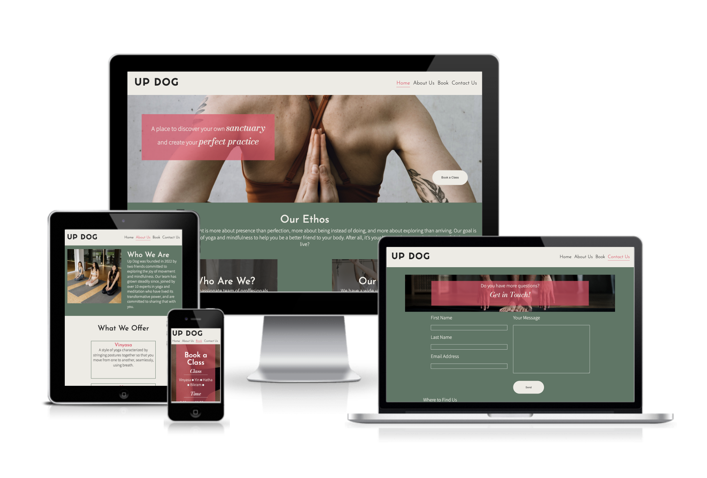

## Contents 
Contents go here

## Current Features 
The Up Dog Studios website is designed to be an intuitive experience that encourages once off learning. All of the features implemented were chosen to create a smooth user experience with the aim of educating the target audience about Up Dog Studios and encouraging them to book a class. 

### Home Page

#### • Navigation Bar 
* The navigation bar is featured on all four pages and includes links to the Logo, Home page, About page, Book page and Contact page. 

* The navigation bar is identical on all pages to assure a smooth navigation experience for the user. 

 

#### • Hero Image 
* The landing page includes an eye catching hero image that ties in with the overall topic of the website and gives the user an immediate idea of what the site's purpose is.

* The image includes a text overlay with a hook text giving a catchy description of Up Dog Studio's mission, and a button linking to the booking page.

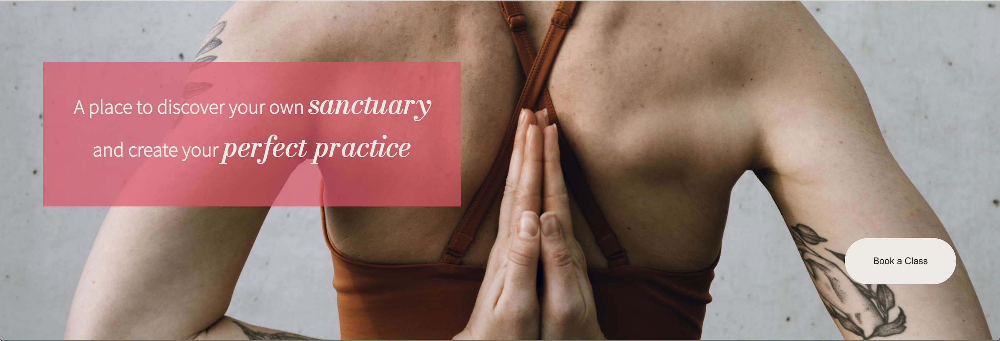

#### •Ethos Section 
* The ethos section has both a paragraph explaing more of Up Dog's mission, as well as two boxes containing information about who Up Dog is, and what classes they have to offer with buttons that link to the relevant pages and sections for more information.

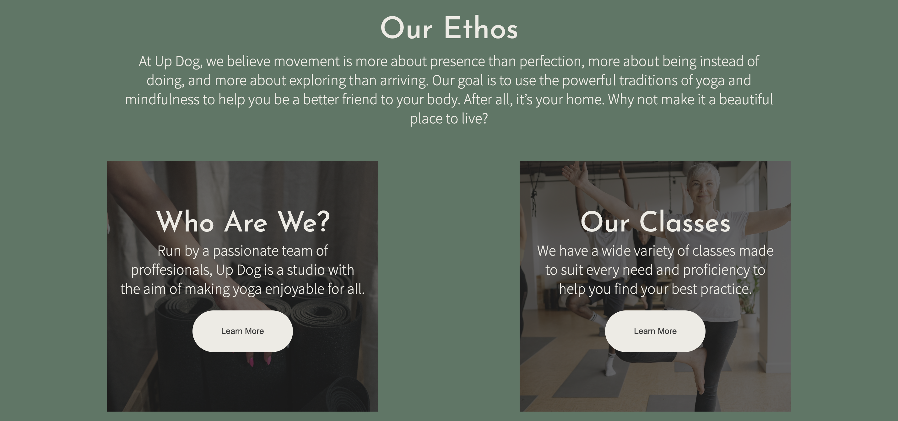

#### • Times Section 
* The times section contains a table with the opening times for the studio on both weekdays and weekends to help give the user an idea of when they are able to visit the studio and book classes.

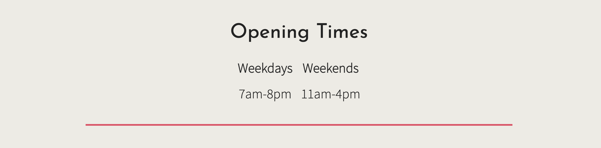

#### • Testimonies Section 
* The testimonies section contains for rows of testimonies with both a headshot of the member as well as a text field containing their experience at Up Dog, the aim of this is to give the user a feel of what to expect from Up Dog and reassure them of the studio's reliability. 

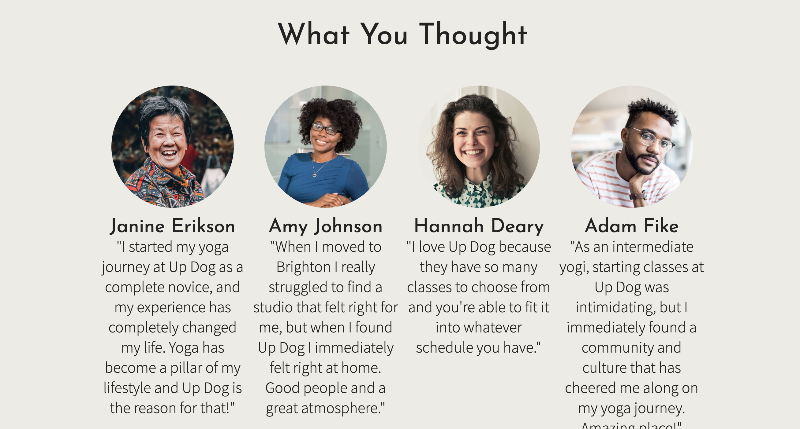

#### • Footer
* The footer bar is featured on all four pages, and contains 4 social media icons that each link to their respective social medias, Facebook, Twitter, Youtube and Instagram. 

### About Page 

#### • Who We Are Section
* This sections contains an image of class members from Up Dog studios and text content explaining more about who Up Dog is. 
* This section will allow the user to gain more information about Up Dog Studios.

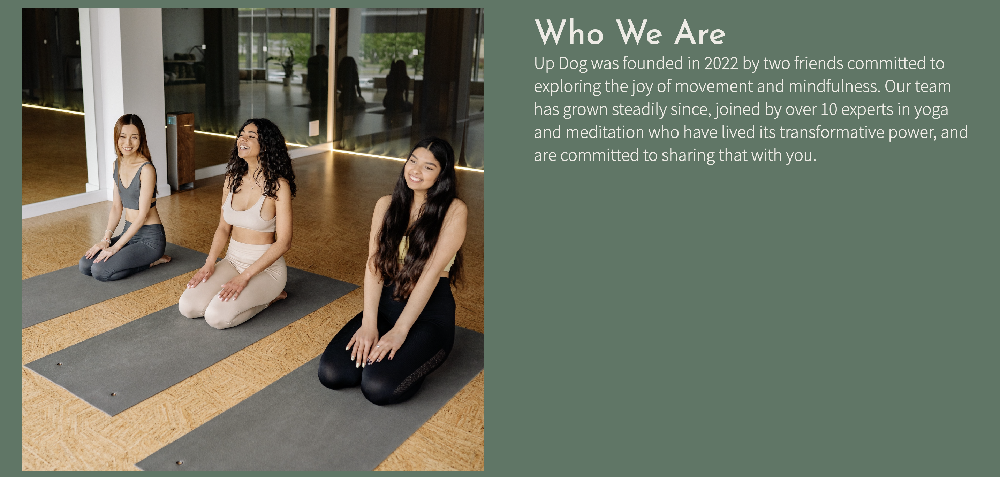

#### • Classes Section 
* This section contains information about the four typses of classes that Up Dog Studios has to offer. Each class is contained within its own box and has both a heading and text content explaining the type of yoga.

* This section will give the user more information on what classes they are able to book.

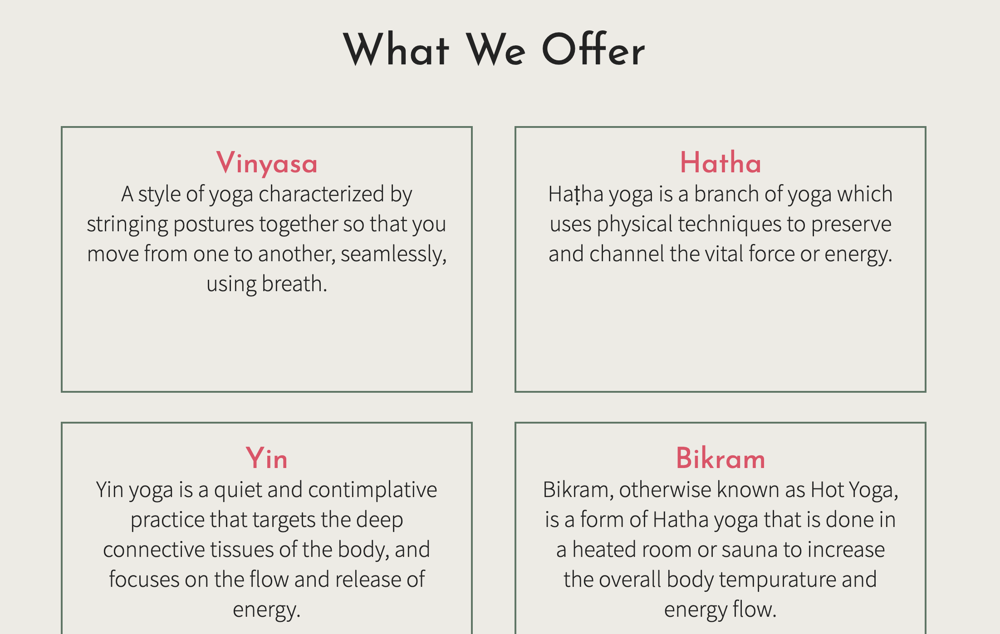

#### • Instructors Section 
* This section introduces the three instructors at Up Dog Studios. 
* Each instructor has a headshot image, their name and a short introduction about who they are.

* This section will give the user reassurance that they will be led by professionals when they book a class with Up Dog.

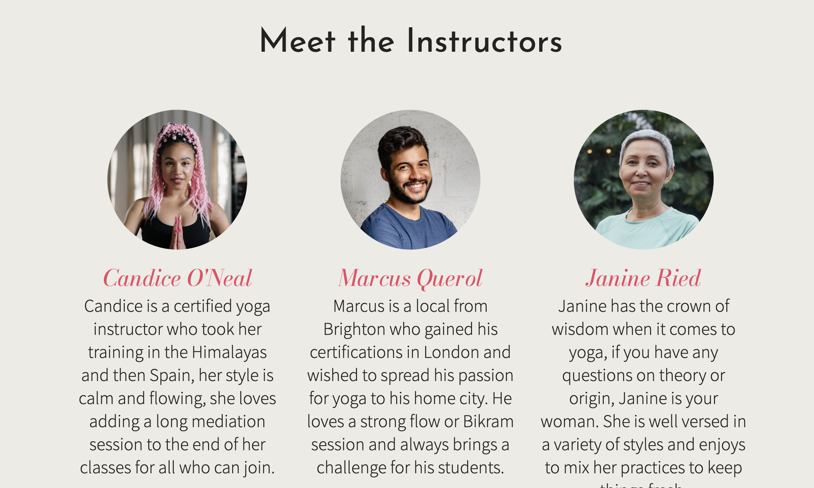

#### • Your Space Section 
* This section contains an image of a class in progress and text content explaining more about the Up Dog studio and what the user can expect from the Up Dog space. 

### Booking Page
The booking page is where the user will book their class in an efficient and user friendly mannor.
The booking page is comprised of 3 input sections: 

* The class type which has text and radio buttons, and the class time, which also is comprised of text and radio buttons for the user to choose from. 

* Next is a text input section for the users name and email address, and finally a submit button.

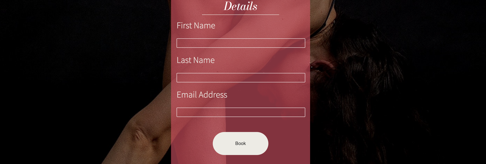

### Contact Page 
Upon arrival to the contact page the user will be met with a welcoming header image that encourages them to get in contact with Up Dog Studios if they have any queries.

* The contact page then has two input field sections, one for the users personal information, a text input field where the user may enter their query, and finally a submit button for the form. 

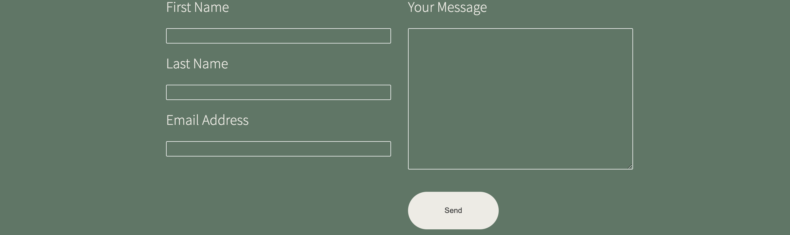

* Finally, the contact page has an iframe map linked to the google maps location of Up Dog Studios, to better help the user find the studio. 

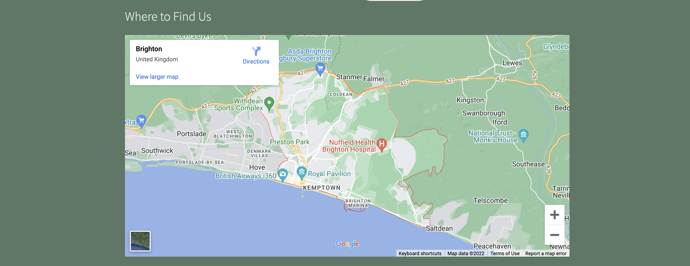

### Submit Button Landing Page 
* When the user clicks the submit button on both the booking form and contact form, the user will be redirected to a landing page that informs them that their information is being processed and they can expect a timely response. 
* The page also includes a button that links back to the home page for easy navigation. 

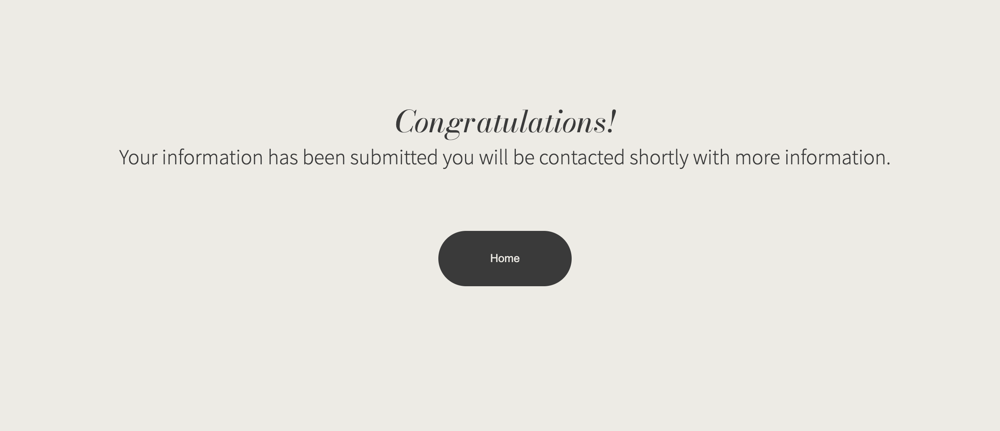

## Future Features 

* A blog for yoga theory and techniques.
* A live streaming platform for classes.
* A video library of recorded classes accesable by members only.

## Technologies Used 

* HTML - For websites structure.
* CSS - For the websites styling.
* Adobe Illustrator - For the wireframes and mockups.
* Gitpod - Used to host and edit the website
* Github - Used to deploy the website.

## Testing 
Up Dog studios has been extensively tested and found to have minimal to no errors in its structure and styling. 

### • Code Validation
All code has been tested through the [W3C html validator](https://validator.w3.org/) and the [W3C css validator](https://jigsaw.w3.org/css-validator/).

* Minor structural errors were found in the html validation and upon fixing no errors were returned. 
* The css validation was returned with no errors.

HTML validation result: 
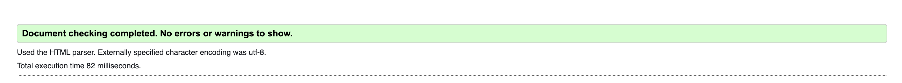

CSS validation result: 
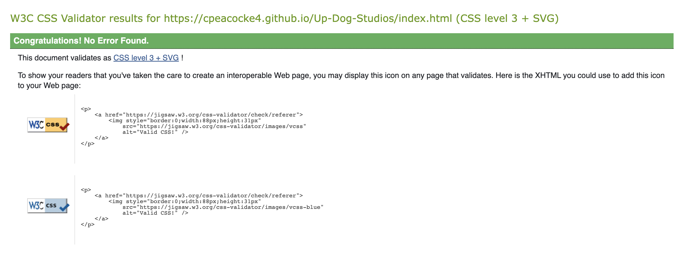

### • Responsiveness Testing 
The responsive design tests were carried out manually using [Google Chrome dev tools](https://developer.chrome.com/docs/devtools/), [Responsive Design Checker](https://responsivedesignchecker.com/), as well as manual testing on various devices.

From 320px screen width up to 2000px and above the Up Dog Studios website remained cohesive in design and layout: 
* All items flexing correctly and minimal changes to the design. 
* All images rendering correctly.
* All links remaining in tact.
* All content showing as desired. 

### • Browser Compatibility 
The Up Dog Studios website was tested on Google Chrome, Safari and Mozilla Firefox and resulted in no errors or major changes in structure, styling or preformance. 

### • Bugs 
#### Fixed Bugs 
During validation a few errors were returned for the index.html file, as listed below: 

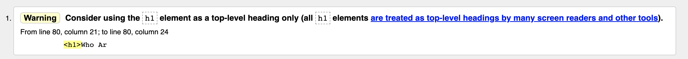
* The h1 heading element was used six times throughout the home page, to fix this error the relevant h1 elements were changed to h2 and the CSS styling was updated to maintain cohesive styling.

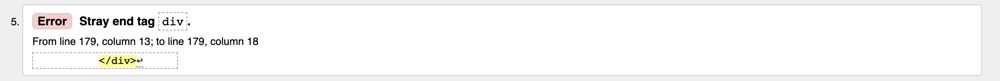
* An oversight during the process of creating the structure caused a stray div ending tag, this was an easy fix through deletion of the stray tag.

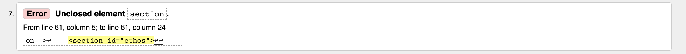
* Another oversight during the creation of the structure, a section was left without a closing tag. This was quickly fixed by adding the relevant closing tag. 

#### Unfixed Bugs
There are no unfixed bugs within the Up Dog Website.

### Preformance testing 
The site was finally tested using [Google Lighthouse](https://developer.chrome.com/docs/lighthouse/overview/) which tested for: 
* Performance.
* Accessibility.
* Best Practices.
* SEO.

The results are shown below: 
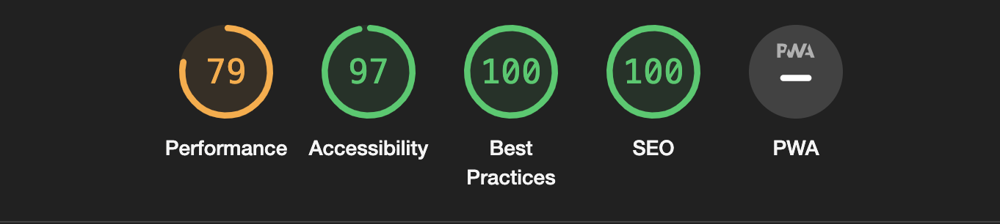
*Note: I was unable to compress certain images further without losing the image quality, therefore the overall performance score was capped at 79%. 

### Deployment 
The site was deployed to GitHub pages. 

The steps to deploy are as follows:
* In the GitHub repository, navigate to the Settings tab
* From the source section drop-down menu, select the Master Branch
* Once the master branch has been selected, the page will be automatically refreshed with a detailed ribbon display to indicate the successful deployment.

The live link can be found [here](https://cpeacocke4.github.io/Up-Dog-Studios/index.html)

