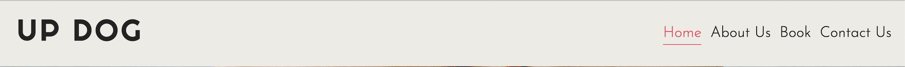

# Up Dog Studios
Up Dog Studios is a yoga studio based in Brighton, England, and run by a passionate team who's goal is to make yoga accessible and enjoyable for everyone. The website is designed to create a space for future yogis to learn more about the studio, it's classes and to start their journey with Up Dog Studios by booking classes.

Welcome to [Up Dog Studios](https://cpeacocke4.github.io/Up-Dog-Studios/index.html)

## Contents 
Contents go here

## Current Features 
The Up Dog Studios website is designed to be an intuitive experience that encourages once off learning. All of the features implemented were chosen to create a smooth user experience with the aim of educating the target audience about Up Dog Studios and encouraging them to book a class. 

### Home Page

#### • Navigation Bar 
The navigation bar is featured on all four pages and includes links to the Logo, Home page, About page, Book page and Contact page. 

The navigation bar is identical on all pages to assure a smooth navigation experience for the user. 

 

#### • Hero Image 
The landing page includes an eye catching hero image that ties in with the overall topic of the website and gives the user an immediate idea of what the site's purpose is.

The image includes a text overlay with a hook text giving a catchy description of Up Dog Studio's mission, and a button linking to the booking page.

#### •Ethos Section 
The ethos section has both a paragraph explaing more of Up Dog's mission, as well as two boxes containing information about who Up Dog is, and what classes they have to offer with buttons that link to the relevant pages and sections for more information.

#### • Times Section 
The times section contains a table with the opening times for the studio on both weekdays and weekends to help give the user an idea of when they are able to visit the studio and book classes.

#### • Testimonies Section 
The testimonies section contains for rows of testimonies with both a headshot of the member as well as a text field containing their experience at Up Dog, the aim of this is to give the user a feel of what to expect from Up Dog and reassure them of the studio's reliability. 

#### • Footer
The footer bar is featured on all four pages, and contains 4 social media icons that each link to their respective social medias, Facebook, Twitter, Youtube and Instagram. 

### About Page 

#### • Who We Are Section
This sections contains an image of class members from Up Dog studios and text content explaining more about who Up Dog is. This section will allow the user to gain more information about Up Dog Studios.

#### • Classes Section 
This section contains information about the four typses of classes that Up Dog Studios has to offer. Each class is contained within its own box and has both a heading and text content explaining the type of yoga.

This section will give the user more information on what classes they are able to book.

#### • Instructors Section 
This section introduces the three instructors at Up Dog Studios. 
Each instructor has a headshot image, their name and a short introduction about who they are.

This section will give the user reassurance that they will be led by professionals when they book a class with Up Dog.

#### • Your Space Section 
This section contains an image of a class in progress and text content explaining more about the Up Dog studio and what the user can expect from the Up Dog space. 

### Booking Page

